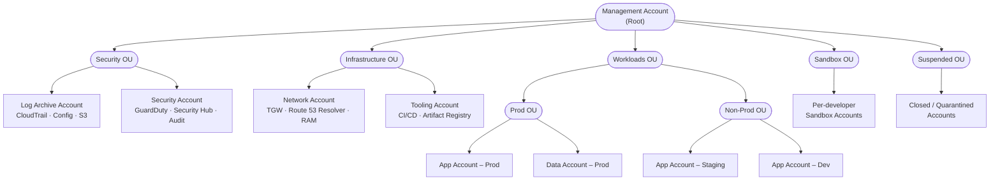
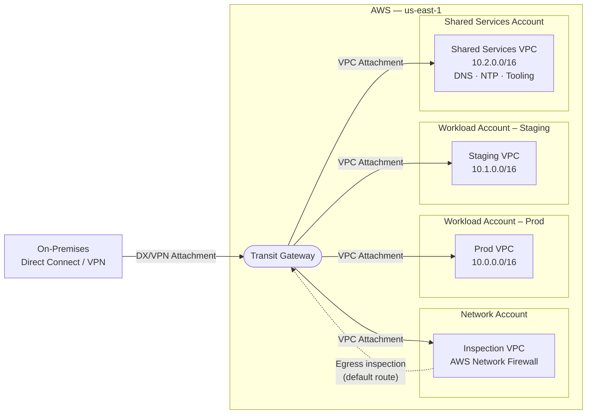
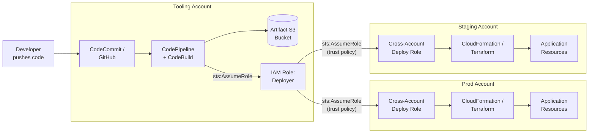
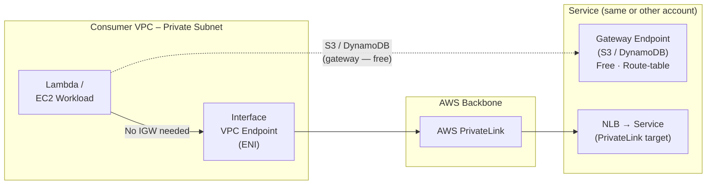
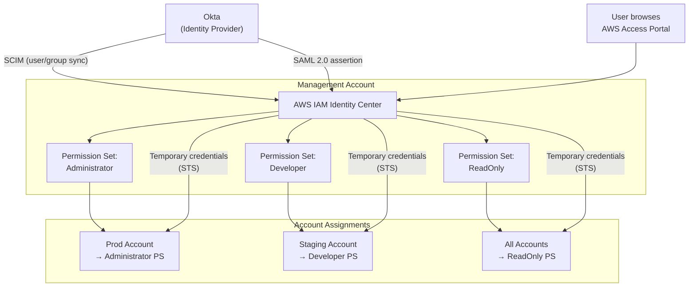
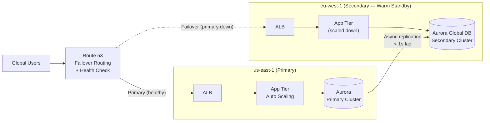

# AWS Architecture Diagrams

Reference diagrams using AWS standard topology conventions. Each shows the canonical shape for a common pattern — see the Full view for design rationale.

---

## 1. Multi-Account Organization Structure

---

## 2. Hub-and-Spoke Network (Transit Gateway)

---

## 3. Cross-Account CI/CD Pipeline

---

## 4. Private Access via VPC Endpoints

---

## 5. Identity Center with External IdP (Okta)

---

## 6. Multi-Region Active-Passive Failover

