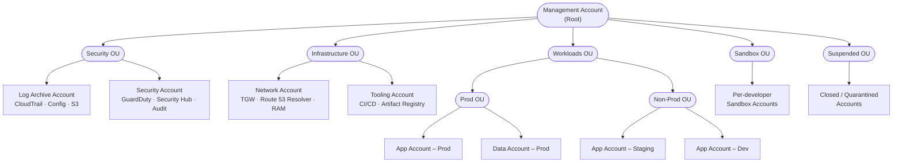
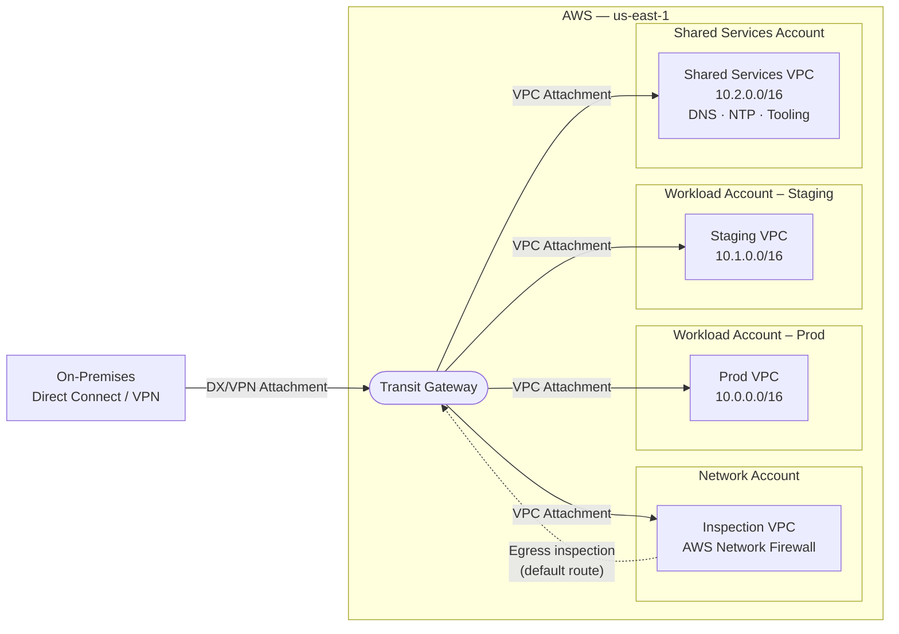
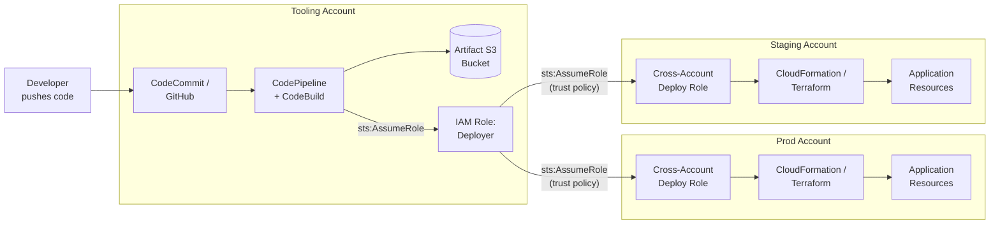
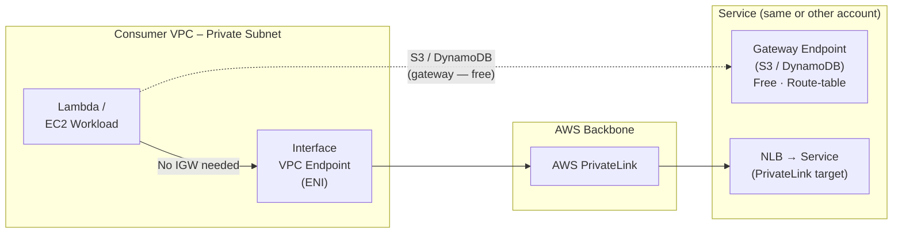
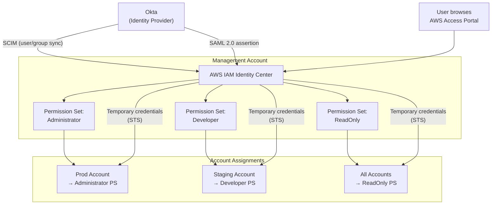
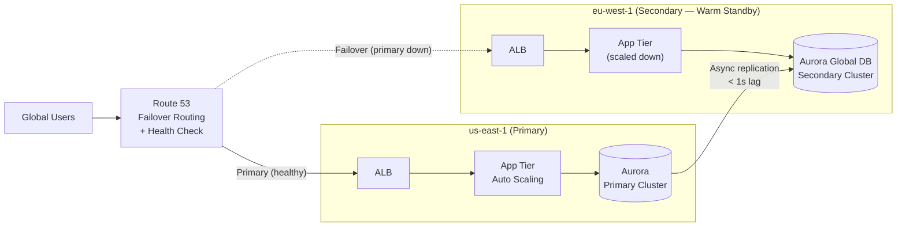

# AWS Architecture Diagrams — In Depth

## A Note on AWS Diagramming Standards

AWS publishes an official [Architecture Icons](https://aws.amazon.com/architecture/icons/) library — PNG and SVG assets for every service, grouped into categories. These icons are the basis for diagrams in AWS blog posts, whitepapers, and customer presentations. Tools that support them natively include draw.io (via the AWS shape library), Lucidchart, Cloudcraft, and the AWS Console's own diagram exports.

The diagrams in this guide use **Mermaid** — a text-based format that renders in any browser without a paid tool. The shapes are schematic rather than icon-faithful, but the topology, naming, and flow are faithful to AWS standard conventions. When producing diagrams for a client deliverable, use draw.io or Lucidchart with the official AWS icon set.

**What "standard" means in AWS diagrams:**
- Accounts are shown as containers (boxes/clouds), not single nodes
- VPCs are shown with subnet-level detail when networking flows matter
- Arrows carry labels identifying the protocol or IAM action (e.g., `sts:AssumeRole`, `Direct Connect`)
- Dotted lines indicate fallback or non-default paths (failover, optional routing)
- Database shapes (cylinders) represent persistent stores; boxes represent compute or services

---

## 1. Multi-Account Organization Structure

### What this diagram shows

The hierarchy flows from the Management Account (Root) down through Organizational Units (OUs) to individual member accounts. OUs exist to group accounts that share the same policy requirements — Service Control Policies (SCPs) attached to an OU apply to every account beneath it.

**Why this OU structure:**

- **Security OU** is intentionally isolated. The Log Archive account has a strict SCP that denies `s3:DeleteObject` and `cloudtrail:StopLogging`, ensuring audit trails are immutable. The Security account is the GuardDuty delegated administrator and Security Hub aggregator — it gets read-only access to every other account via cross-account roles, not production credentials.

- **Infrastructure OU** holds shared platform services. The Network account owns Transit Gateway, Route 53 Resolver rules, and shares them to workload accounts via AWS RAM. The Tooling account runs CI/CD pipelines that assume cross-account deploy roles — it never has persistent credentials in production.

- **Workloads OU** is subdivided into Prod and Non-Prod OUs so that stricter SCPs (e.g., restrict regions, require tag policies, deny IAM user creation) apply only to production. Non-prod can have looser policies for developer iteration speed.

- **Sandbox OU** has the most permissive SCPs — developers can experiment freely but cannot connect to production resources (enforced by SCP denying TGW attachment creation and RAM sharing).

- **Suspended OU** quarantines accounts being decommissioned. A strict SCP denies all actions, preventing any resource creation or modification while billing and audit trails remain intact.

**What's not shown:** The Management Account itself has no workloads. SCPs do not apply to it (a hard AWS constraint), which is why all sensitive operations are delegated to the Security account. The Management Account should have minimal IAM users — ideally none, with humans accessing it only via Identity Center break-glass access.

---

## 2. Hub-and-Spoke Network (Transit Gateway)

### What this diagram shows

Transit Gateway (TGW) is the routing hub. Each VPC connects via a TGW attachment. The TGW maintains separate route tables per attachment group — this is the key architectural lever that controls which VPCs can talk to each other.

**Route table design (not shown in diagram, but critical):**

| Route Table | Attached to | Routes |
|---|---|---|
| Prod RT | Prod VPC | Shared Services, Inspection VPC, On-prem only |
| Non-Prod RT | Staging VPC | Shared Services, Inspection VPC |
| Inspection RT | Inspection VPC | All RFC1918 via firewall |
| On-prem RT | DX/VPN | Only explicitly whitelisted CIDRs |

**The Inspection VPC pattern:** All internet egress (and optionally inter-VPC traffic) is routed through the Inspection VPC where AWS Network Firewall or a third-party appliance runs stateful inspection. The dotted line shows that the Inspection VPC advertises a `0.0.0.0/0` default route back into TGW — any VPC with a default route pointing to TGW will automatically hairpin through the firewall.

**Cross-account TGW sharing:** The TGW lives in the Network account and is shared to workload accounts via AWS RAM. Workload accounts create VPC attachments to the shared TGW — they don't need their own TGWs. This is the standard multi-account network topology for 5+ VPCs.

**What VPC peering would look like instead:** Each VPC would need a peering connection to every other VPC it communicates with. For 4 VPCs that need full mesh: 6 peering connections, 6 × 2 route table entries per VPC, 6 security group references to update. For 10 VPCs: 45 connections. TGW eliminates this — each VPC has one attachment, one set of route table entries.

---

## 3. Cross-Account CI/CD Pipeline

### What this diagram shows

The CI/CD pipeline runs entirely in the Tooling account. It never has standing credentials in Prod — instead, it uses `sts:AssumeRole` to temporarily assume a deploy role in the target account. The target account's deploy role has a trust policy that explicitly allows only the Tooling account's deployer role to assume it.

**The IAM chain:**

1. CodeBuild runs with the Tooling account's `DeployerRole` (identity in the Tooling account).
2. `DeployerRole` calls `sts:AssumeRole` with the ARN of the cross-account role in Prod: `arn:aws:iam::PROD_ACCOUNT_ID:role/CICDDeployRole`.
3. `CICDDeployRole` in Prod has a trust policy: `{ "Principal": { "AWS": "arn:aws:iam::TOOLING_ACCOUNT_ID:role/DeployerRole" }, "Action": "sts:AssumeRole" }`.
4. The session is bounded by the deploy role's permission policy — typically `cloudformation:*`, `s3:*` (for artifact bucket access), and the specific resource permissions the stack needs.

**SCP enforcement:** A Service Control Policy on the Prod OU denies `iam:CreateUser`, `iam:CreateAccessKey`, and `console:*` for all principals except the break-glass role. This means even if someone creates an IAM user in Prod, it can't be used to log in. Human engineers access Prod only via Identity Center federated sessions, never via IAM credentials.

**Artifact bucket cross-account access:** The artifact bucket lives in the Tooling account. The deploy role in Prod needs permission to read from it — this is granted via an S3 bucket policy on the artifact bucket that allows the Prod deploy role ARN. The KMS key encrypting the bucket similarly has a key policy granting the Prod role decrypt permissions.

---

## 4. Private Access via VPC Endpoints

### What this diagram shows

Two types of VPC endpoints for keeping traffic private:

**Gateway Endpoints (S3 and DynamoDB only):**
- Free — no hourly charge, no per-GB charge.
- Work via route table: a prefix list entry is added to the subnet's route table that routes S3/DynamoDB traffic to the endpoint, bypassing the NAT Gateway and Internet Gateway entirely.
- Regional only — they reach S3 and DynamoDB in the same region. Cross-region S3 access still routes through the internet.

**Interface Endpoints (everything else, including your own services):**
- Create an ENI in a subnet with a private IP address. DNS resolution for the service's endpoint hostname resolves to this private IP.
- Cost: ~$0.01/hr per AZ the endpoint is deployed in, plus $0.01/GB processed.
- Support endpoint policies — you can restrict which IAM principals and which S3 buckets the endpoint can reach, providing an extra layer of access control beyond bucket policies.

**The PrivateLink model for your own services:**
If you want to expose an internal service (running behind an NLB) to another VPC or account without VPC peering, you create an Endpoint Service. The consumer account creates an interface endpoint pointing to your Endpoint Service. Traffic never leaves AWS's backbone. You control which AWS accounts can create endpoints to your service via an allowlist.

**Security implication:** With the right combination of endpoint policies and S3 bucket policies using `aws:sourceVpce` conditions, you can enforce that an S3 bucket is *only* accessible from within a specific VPC endpoint — making it unreachable from the public internet even if the bucket were misconfigured as public.

---

## 5. Identity Center with External IdP (Okta)

### What this diagram shows

Identity Center is the single point of control for human access across all accounts in the organization. By federating with Okta, user provisioning and deprovisioning happen once in Okta — SCIM automatically syncs users and groups to Identity Center, so when an employee is offboarded in Okta, their AWS access is revoked within minutes.

**Two separate protocols serving different purposes:**
- **SCIM** (System for Cross-domain Identity Management): a REST API that Okta uses to push user and group membership changes to Identity Center in near-real time. This keeps the Identity Center user directory synchronized with Okta without manual action.
- **SAML 2.0**: the authentication protocol. When a user logs in to the AWS Access Portal, Identity Center redirects to Okta, Okta authenticates the user (with MFA), and returns a signed SAML assertion. Identity Center validates the assertion and issues temporary STS credentials for the target account and permission set.

**Permission Set mechanics:** A Permission Set is a template that becomes an IAM role in every account it's assigned to. The role's name is standardized: `AWSReservedSSO_<PermissionSetName>_<random-suffix>`. The role has a trust policy that only allows `sso.amazonaws.com` as the principal — meaning only Identity Center can vend credentials for it. No human can assume it directly with `aws sts assume-role`.

**ABAC scaling:** For organizations with many teams and accounts, explicit account-to-permission-set assignments become unwieldy. Attribute-Based Access Control lets you define a single assignment rule: "if the user's Okta group matches the account's tag `Team`, grant the `Developer` Permission Set." This scales to hundreds of accounts without individual assignments. It requires setting up attribute mappings in Identity Center and tagging accounts consistently.

---

## 6. Multi-Region Active-Passive Failover

### What this diagram shows

An active-passive (warm standby) multi-region architecture. Traffic normally flows entirely to us-east-1. The secondary region runs reduced-capacity infrastructure at all times, ready to scale up on failover. Route 53 monitors the primary ALB endpoint and automatically updates DNS when it detects failure.

**Route 53 failover record set configuration:**
- Primary record: ALB DNS name in us-east-1, associated with a health check hitting `/health`. TTL = 60 seconds.
- Secondary record: ALB DNS name in eu-west-1, failover type = `SECONDARY`. Only becomes active when the primary health check fails.
- Health check: HTTPS, 10-second interval, failure threshold = 3. This gives a detection window of ~30 seconds before failover starts propagating.

**Aurora Global Database replication details:**
- Replication is asynchronous — the primary acknowledges writes immediately, replication happens in the background.
- Typical lag: under 1 second. Monitor `aurora_global_db_replication_lag` in CloudWatch; alarm if it exceeds your RPO threshold.
- On failover: managed failover promotes the secondary to primary in under a minute. During promotion, writes are briefly blocked while the new primary establishes itself.
- The secondary cluster serves read traffic during normal operations — you can route read-heavy query traffic there to reduce load on the primary.

**What "warm standby" means practically:**
The secondary app tier runs 1–2 instances instead of the production count (e.g., 8). The ASG maximum is set to 10 (matching production), so on failover, Auto Scaling can launch additional instances. The startup time for new instances (typically 3–5 minutes with AMI baking) is the real RTO driver — not the DNS propagation.

**Where active-active differs from this:**
In an active-active setup, both regions receive live traffic simultaneously, Route 53 uses latency-based routing instead of failover routing, and DynamoDB Global Tables or Aurora Global Database with write forwarding handles concurrent writes from both regions. Active-active eliminates RTO (no failover, just reduced capacity) but adds complexity, cost (3× writes on DynamoDB Global Tables for 3 regions), and requires the application to handle eventual consistency.
