# System Design Diagrams — Full Reference

## Three-Tier Web Architecture

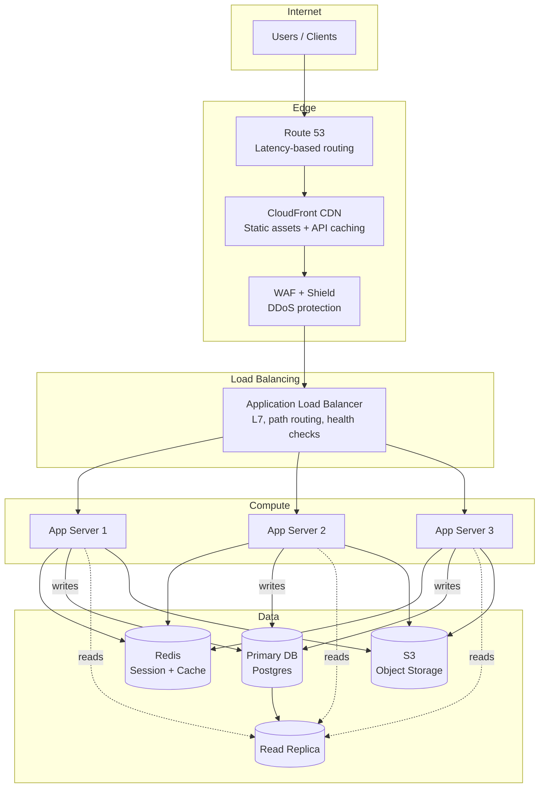

## Microservices Architecture

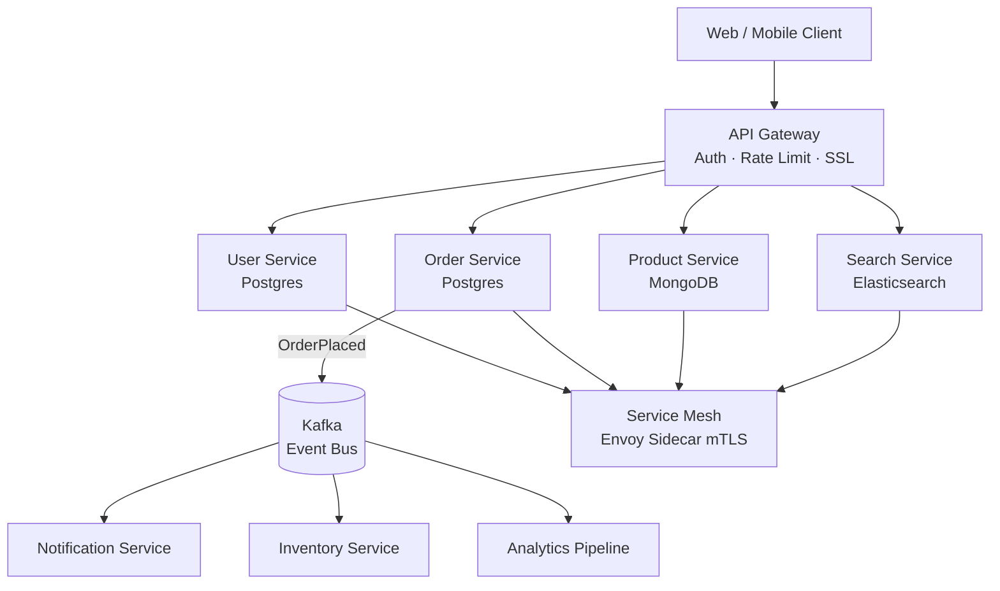

## Data Pipeline Architecture

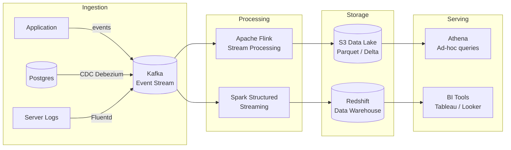

## CQRS + Event Sourcing

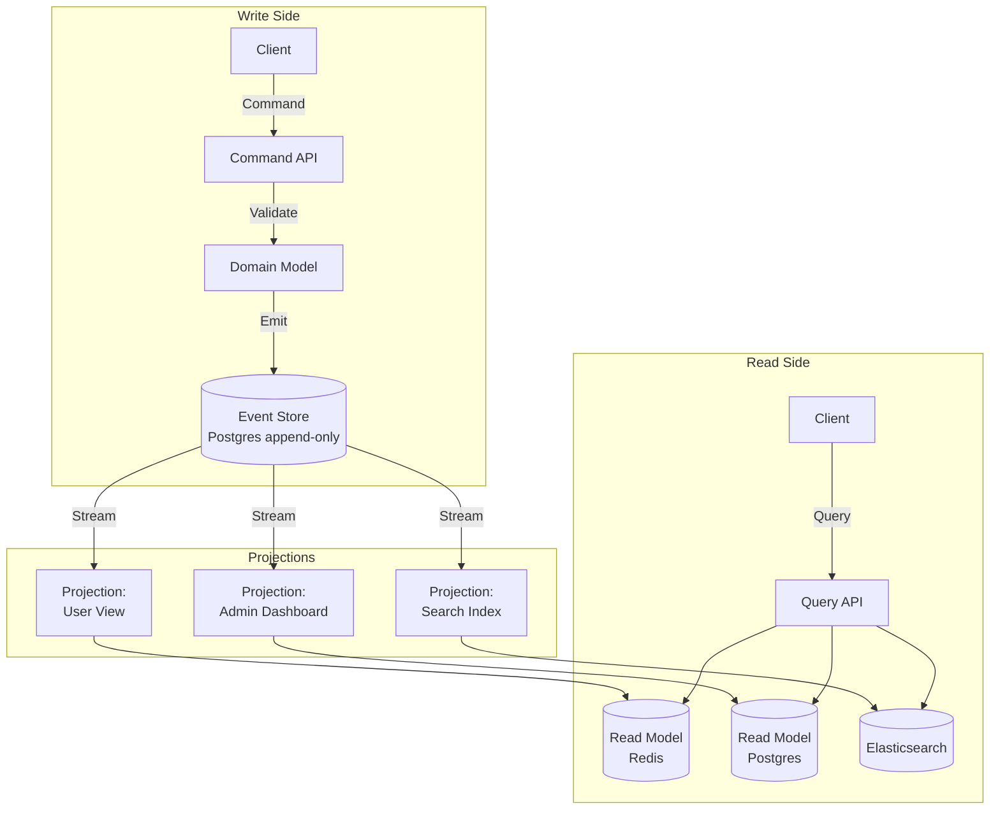

## Distributed Cache (Redis Cluster)

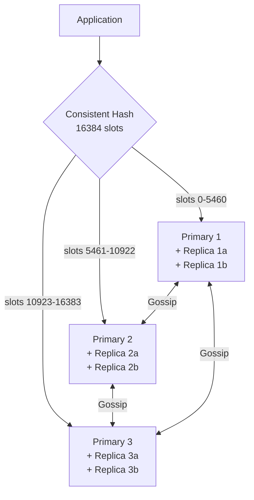

## Saga Pattern (Orchestration)

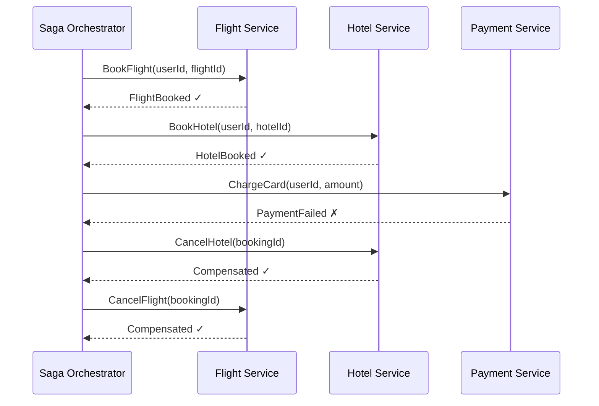

## Message Fan-Out (SNS + SQS)

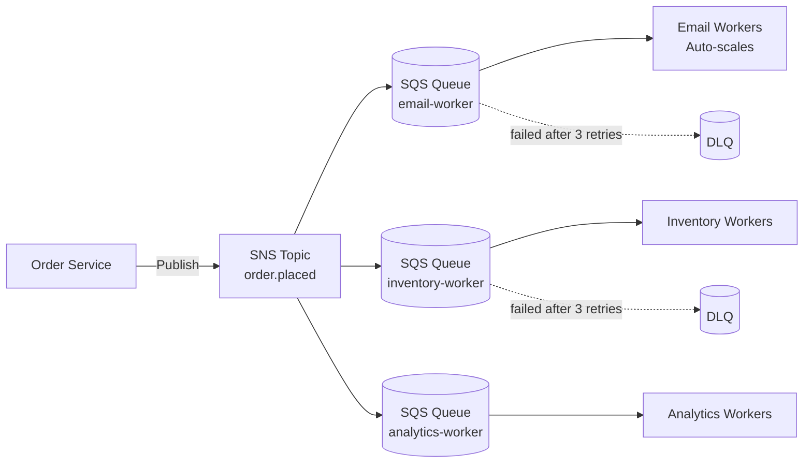

## Distributed Rate Limiter (Sliding Window in Redis)

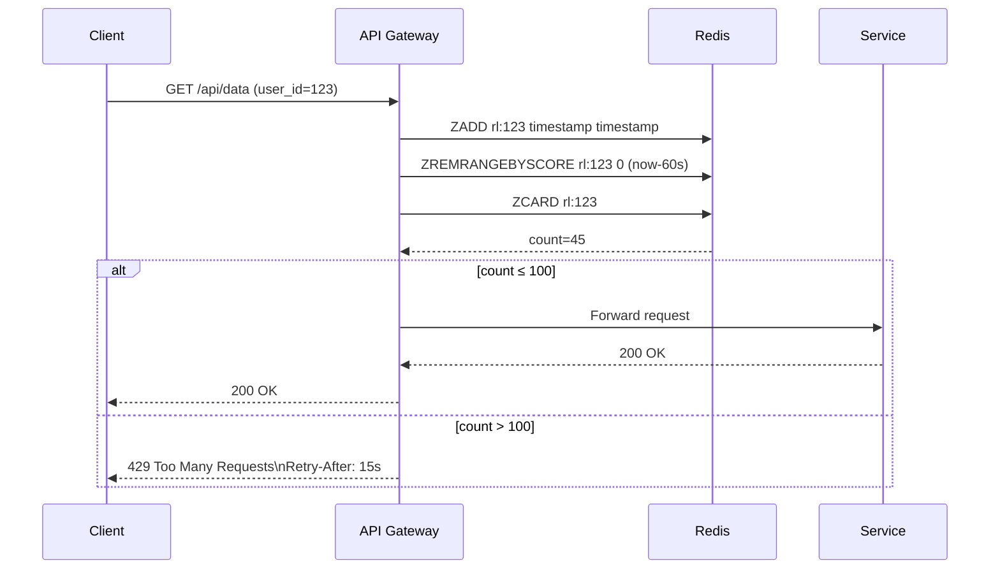

## Service Mesh Traffic Flow

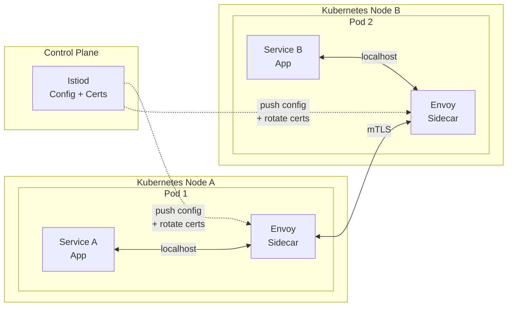

## Blue-Green Deployment

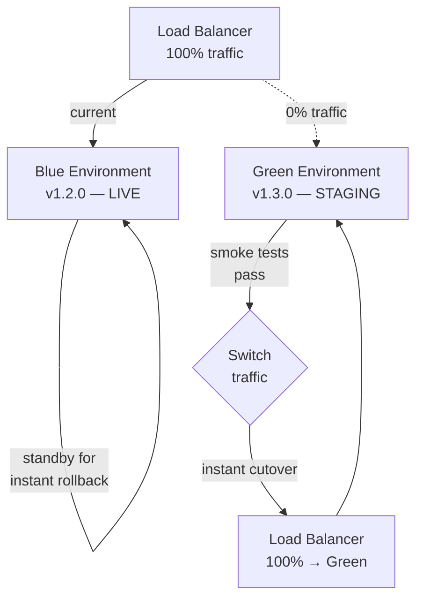

## Canary Deployment

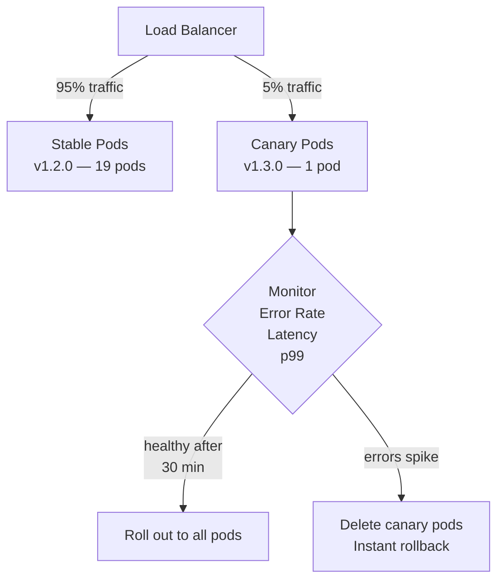
