# System Design Diagrams

## Read-Heavy Service (Cache-Aside)

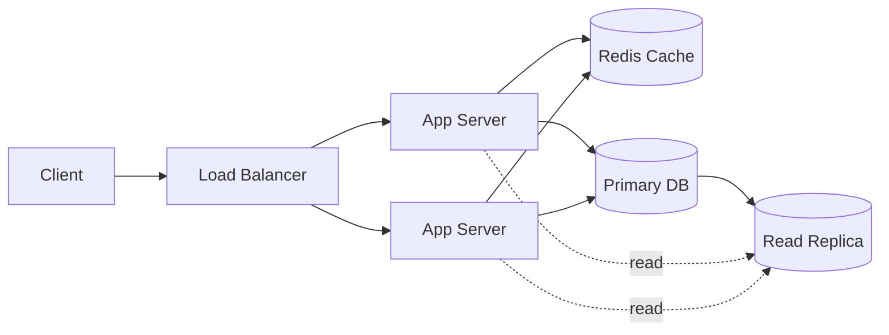

## Write-Heavy Service (Queue + Workers)

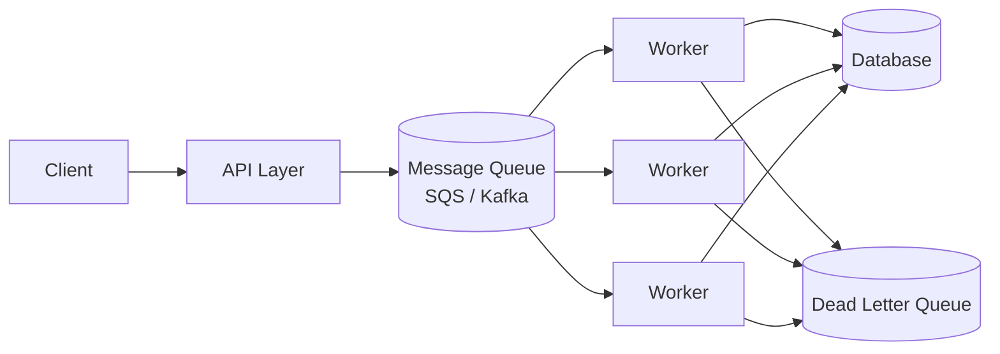

## Microservices with API Gateway

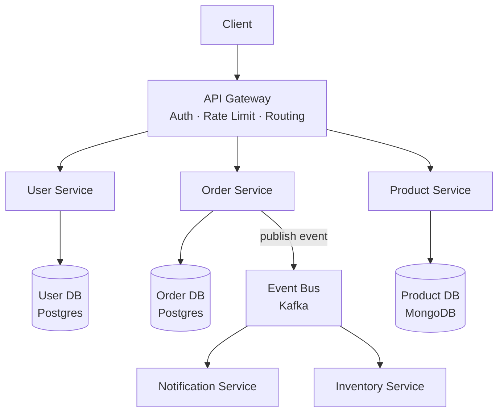

## Event Sourcing + CQRS

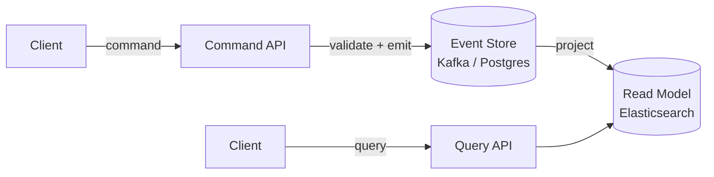

## URL Shortener Architecture

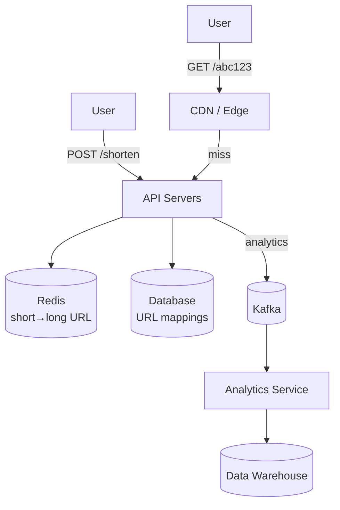

## Social Feed (Fan-out on Write)

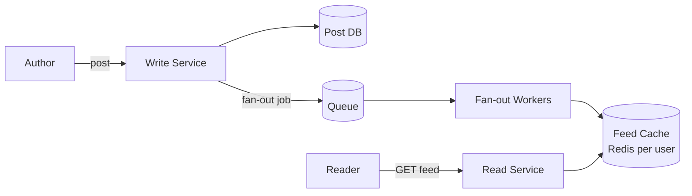

## Distributed Rate Limiter

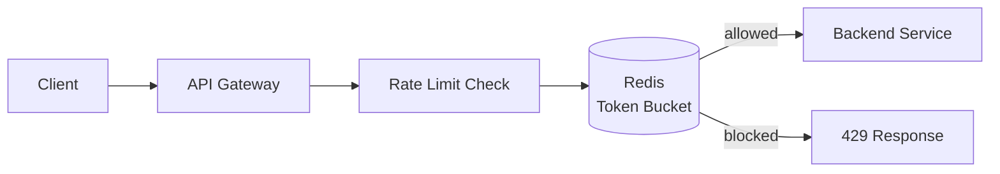

## Notification System

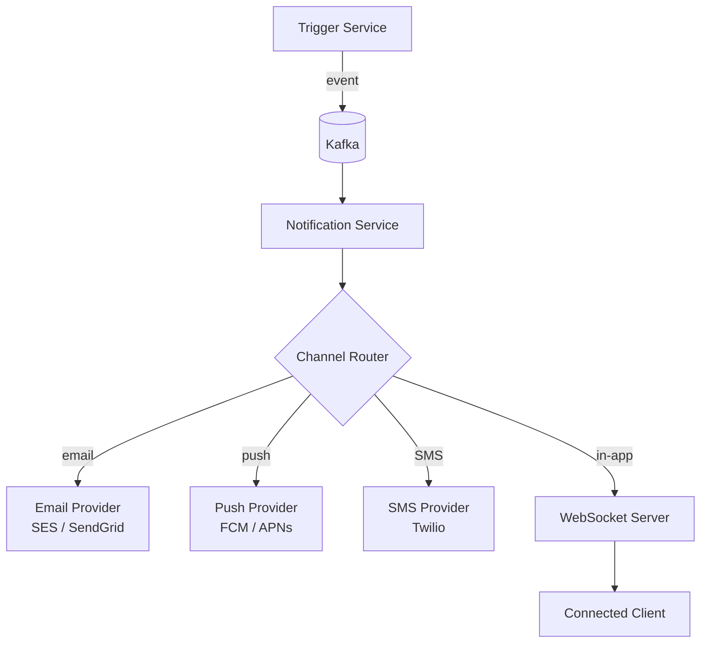

## Web Crawler Architecture

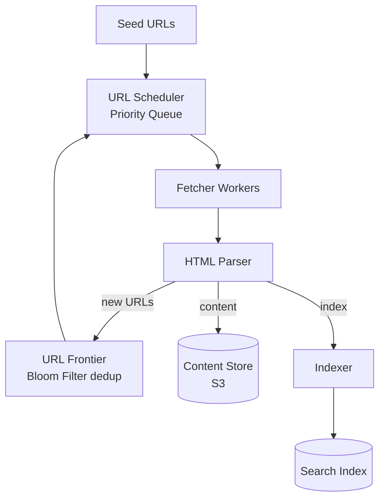

## Multi-Region Active-Active

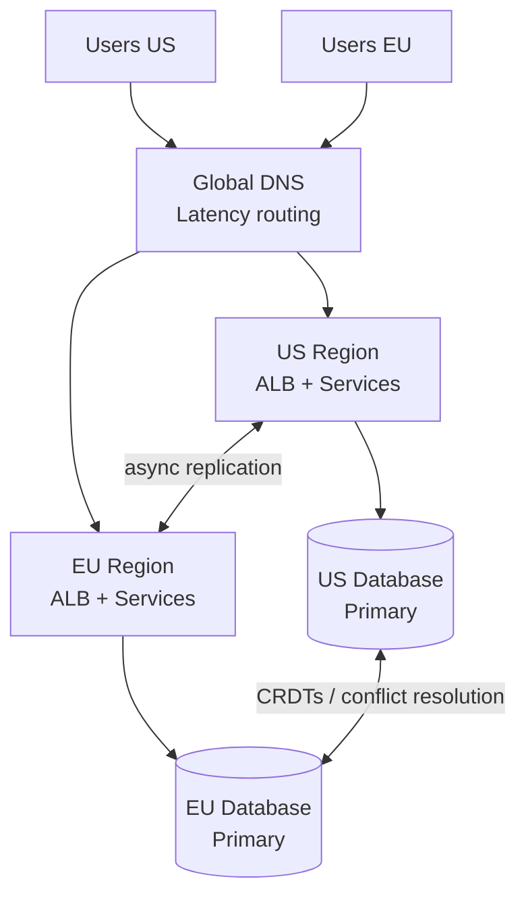

## Service Mesh (Sidecar Pattern)

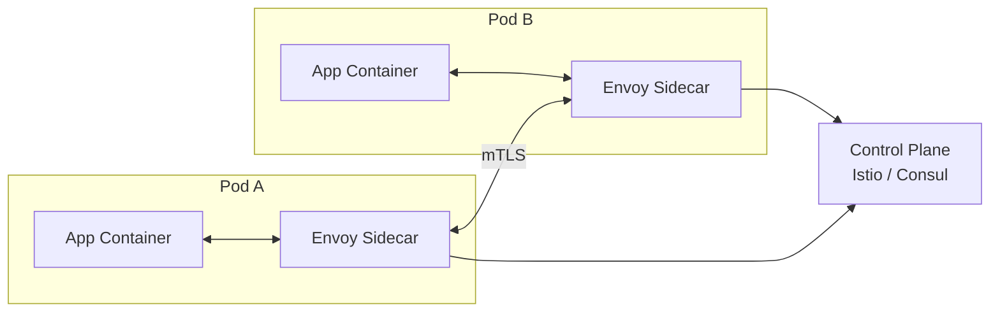
